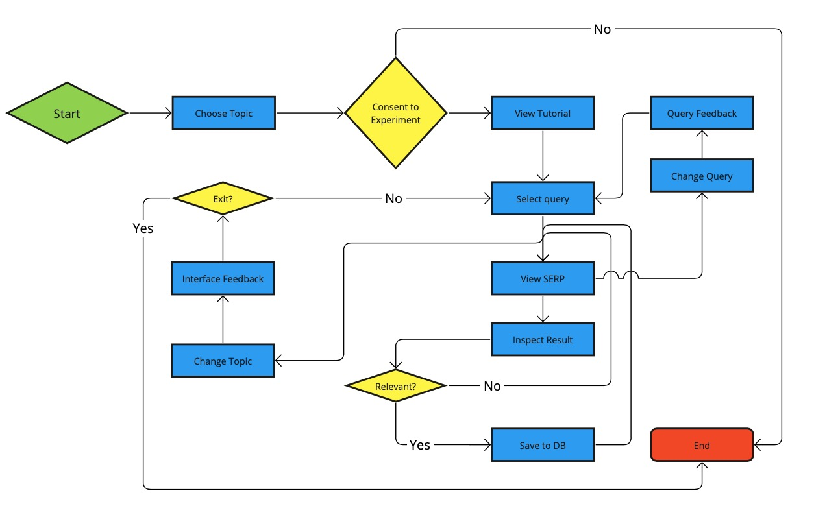

# The Influence of Presentation and Performance on User Satisfaction

Data repository for the CHIIR paper: [The Influence of Presentation and Performance on User Satisfaction](https://dl.acm.org/doi/10.1145/3627508.3638335)

Abstract:

Information Retrieval (IR) systems are designed to provide users with a ranked list of results based on their queries. The effectiveness of an IR system is gauged not just by its ability to retrieve relevant results but also by how it presents these results to users; an engaging presentation often correlates with increased user satisfaction. While existing research has delved into the link between user satisfaction, IR performance metrics, and presentation, these aspects have typically been investigated in isolation. Our research aims to bridge this gap by examining the relationship between query performance, presentation and user satisfaction. For our analysis, we conducted a between-subjects experiment comparing the effectiveness of various result card layouts for an ad-hoc news search interface. Drawing data from the TREC WaPo 2018 collection, we centered our study on four specific topics. Within each of these topics, we assessed six distinct queries with varying nDCG values. Our study involved 164 participants who were exposed to one of five distinct layouts containing result cards, such as “title”, “title+image”, or “title+image+summary”. Our findings indicate that while nDCG is a strong predictor of user satisfaction at the query level, there exists no linear relationship between the performance of the query, presentation of results and user satisfaction. However, when considering the total gain on the initial result page, we observed that presentation does play a significant role in user satisfaction (at the query level) for certain layouts with result cards such as, title+image or title+image+summary. Our results also suggest that the layout differences have complex and multifaceted impacts on satisfaction. We demonstrate the capacity to equalize user satisfaction levels between queries of varying performance by changing how results are presented. This emphasizes the necessity to harmonize both performance and presentation in IR systems, considering users’ diverse preferences. Ultimately, our insights can steer the evolution of more user-aligned IR systems, underscoring the balance between system performance and result presentation.

---

    @inproceedings{10.1145/3627508.3638335,author = {Pathak, Kanaad and Azzopardi, Leif and Halvey, Martin},title = {The Influence of Presentation and Performance on User Satisfaction},year = {2024},isbn = {9798400704345},publisher = {Association for Computing Machinery},address = {New York, NY, USA},url = {https://doi.org/10.1145/3627508.3638335},doi = {10.1145/3627508.3638335},pages = {77–86},numpages = {10},keywords = {Empirical Study, Human-Computer Interaction, Information Retrieval (IR), Interface Layouts, Query Performance, Retrieval Effectiveness, Search Interfaces, Search Result Presentation, User Satisfaction},location = {Sheffield, United Kingdom},series = {CHIIR '24}}

#### Collection

TREC WAPO 2018

#### Topics

| topic_id | topic                        |
|----------|------------------------------|
| 367      | Pirates at Sea               |
| 341      | Airport Security             |
| 408      | Tropical Storms              |
| 363      | Transportation Tunnel Disasters |

#### Interfaces

| Interface Type       | Description                                 | Card Type |
|-------------|---------------------------------------------|-----------|
| BASE        | Title only                                  | 3         |
| BASE_WAPO   | Title + Image + Summary [image on the right]| 6         |
| BASE_TIS    | Title + Image + Summary                     | 2         |
| RAND        | Random                                      |           |
| BASE_GOOGLE | Title + Image [image on the right]          | 5         |

---

#### Actions users could perform

The user could:

 1. Select a query 
 2. View a SERP (recorded under `serp_annotations.csv`)
 3. Click on a result card on the SERP (recorded under `serp_annotations.csv`)
 4. Click on whether a document is Relevant or Non-Relevant (recorded under `document_annotation.csv`)
 5. Save a Relevant document (recorded under `document_annotation.csv`)
 6. Provide a satisfaction rating for a query (recorded under `query_feedback.csv`)
 7. Provide a satisfaction rating for an interface (recorded under `interface_feedback.csv`)

#### Data Recorded

---- `serp_annotations.csv`----
 1. doc_id
 2. query
 3. rank
 4. click (0 = skipped, 1 = clicked)
 5. time_spent 
 6. judgement
 7. actual_qrel_value (extracted from qrels file of TREC WaPo)
 8. card_type
 9. interface_type
 10. topic_id  
 11. user
 12. cards_shown_on_page

---- `document_annotation.csv`----

 1. doc_id
 2. document_title 
 3. query
 4. judgement (1 = relevant. 0 = non-relevant)
 5. actual_qrel_value
 6. card_type
 7. notes (text recorded on relevance criteria before saving a document)
 8. interface_type
 9. doc_browsing_time
 10. doc_decision_time
 11. doc_mark_item_time
 12. topic_id
 13. user
 14. total_time

